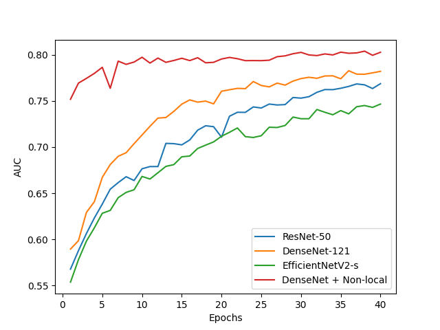
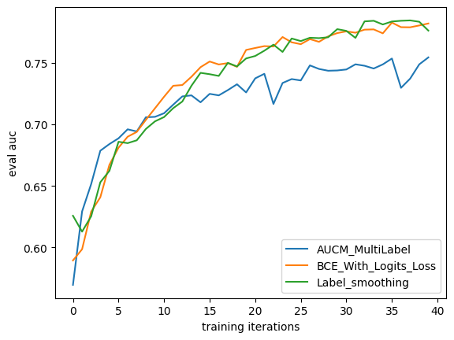

# Chest X-ray Image Analysis

In this project, we trained multi-class classification models on the NIH dataset to diagnose different diseases. We first built models based on different neural network architectures (ResNet, DenseNet, EfficientNetV2), and then tried some different optimization methods to improve model performance.

## Dataset
We use the resized NIH dataset, which can be downloaded [here](https://academictorrents.com/details/e615d3aebce373f1dc8bd9d11064da55bdadede0). Rename the downloaded folder to *images-NIH-224*, and put it in the path you want.

## Install
Dependencies:
- Python 3.9.
- Install other dependencies via the "pip install -r requirements.txt" command.

## Running command
### Train:
```
python train_model.py \
 --test False \
 --dataset_dir /root/directory/of/NIH \
 --model resnet50/densenet/EfficientNet_V2 \
 --batch_size 8 \
 --num_epochs 40 \
 --loss_fuc BCEWithLogitsLoss/AUCM_MultiLabel/label_smoothing \
 --output_dir /output/directory
```
See other configuration options in *train_model.py*.
### **Test the code with a small amount of data:**
```
python train_model.py \
 --test True \
 --dataset_dir /root/directory/of/NIH \
 --model resnet50/densenet/EfficientNet_V2 \
 --batch_size 8 \
 --num_epochs 40 \
 --loss_fuc BCEWithLogitsLoss/AUCM_MultiLabel/label_smoothing \
 --output_dir /output/directory
```
### Testing:
```
python test_model.py --model_path path/to/the/model
```

## Examples
### Baseline models
ResNet50:
```
python train_model.py \
 --test False \
 --dataset_dir /root/directory/of/NIH \
 --model resnet50 \
 --batch_size 8 \
 --num_epochs 40 \
 --loss_fuc BCEWithLogitsLoss \
 --output_dir /output/directory
```
DenseNet101:
```
python train_model.py \
 --test False \
 --dataset_dir /root/directory/of/NIH \
 --model densenet \
 --batch_size 8 \
 --num_epochs 40 \
 --loss_fuc BCEWithLogitsLoss \
 --output_dir /output/directory
```
EfficientNetV2-s:
```
python train_model.py \
 --test False \
 --dataset_dir /root/directory/of/NIH \
 --model EfficientNet_V2 \
 --batch_size 8 \
 --num_epochs 40 \
 --loss_fuc BCEWithLogitsLoss \
 --output_dir /output/directory
```
### AUCM MultiLabel loss function
```
python train_model.py \
 --test False \
 --dataset_dir /root/directory/of/NIH \
 --model densenet \
 --batch_size 8 \
 --num_epochs 40 \
 --loss_fuc AUCM_MultiLabel \
 --output_dir /output/directory
```
### Densenet + Non-local module
```

```
### Label smoothing
```
python train_model.py \
 --test False \
 --dataset_dir /root/directory/of/NIH \
 --model densenet \
 --batch_size 8 \
 --num_epochs 40 \
 --loss_fuc label_smoothing \
 --output_dir /output/directory
```
## Results
AUC comparison of different models, note that the Densenet+Non-local model is fine-tuned on the pre-trained model.



The performance of the model when using different loss functions.

